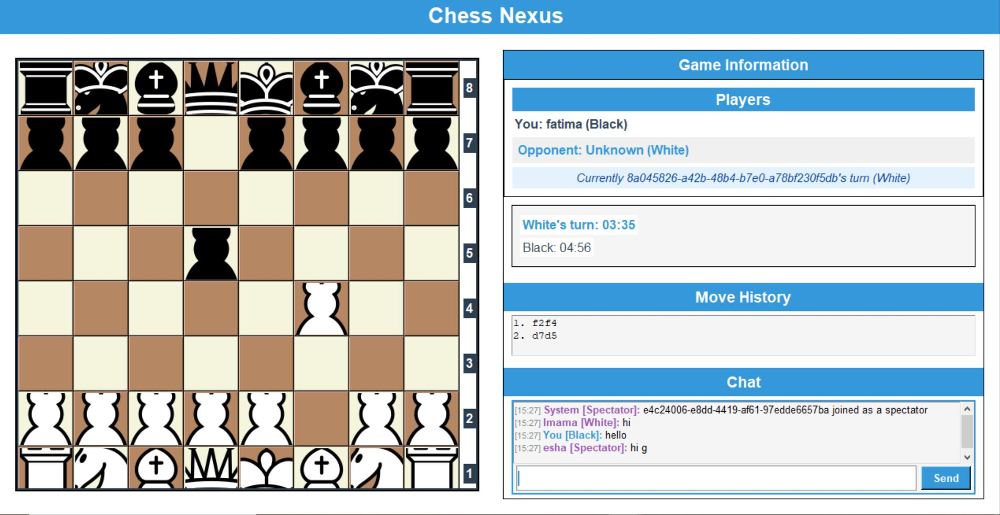

# ♟️ Multiplayer Chess Game  

  

A real-time **multiplayer chess game** built with **Python**, featuring a **Pygame-based GUI** and **socket programming** for networking. It supports lobby matchmaking, live game sessions, and uses `python-chess` for rule validation.  

---

## 🚀 Features  
- 🎮 Real-time online chess matches  
- 🖥️ Interactive GUI built with Pygame  
- 🔗 Client-server communication via sockets  
- 🧩 Core chess logic with `python-chess`  
- 🎲 Lobby & matchmaking support  

---

## 📂 Project Structure  

- **`server/`** → Server-side code for managing game sessions and communication  
- **`client/`** → Client-side code with GUI for players  
- **`common/`** → Shared logic for chess rules, messaging, and constants  

```

📁 client
├── images/               # GUI assets like pieces
├── client.py             # Main client logic
├── gui.py                # UI logic (Pygame)
├── utils.py              # Helper methods

📁 common
├── chess\_logic.py        # Core chess rules
├── constants.py          # Configurable constants
├── message.py            # Common message formats or parsing

📁 server
├── server.py             # Socket server
├── game\_session.py       # Individual game logic per pair
├── lobby.py              # Lobby management and matchmaking
├── utils.py              # Server-side helpers

````

---

## ⚙️ Requirements  
- Python **3.8+**  
- [pygame](https://www.pygame.org/)  
- [python-chess](https://python-chess.readthedocs.io/)  

Install dependencies:  
```bash
pip install -r requirements.txt
````

---

## ▶️ How to Run

1. Start the **server**:

   ```bash
   python -m server.server
   ```

2. Start the **client GUI**:

   ```bash
   python -m client.gui
   ```

---

## 📖 Documentation

For detailed explanation of architecture, design, and implementation, check the [Project Documentation](https://docs.google.com/document/d/1lUAXp2R_7SiedBwF9k8MTPPfWv9EDPAtt2fK_3woCqc/edit?usp=sharing).
[Demo video](https://drive.google.com/file/d/1QfOgesWDNoGJe80HivZUrO9U1mmw6yJk/view?usp=sharing).

---

## 🎯 Future Enhancements

* Add **timer-based matches** (blitz chess)
* Enable **spectator mode**
* Player **ELO ratings & leaderboards**
* Mobile-friendly GUI with Kivy

---

```

---

✅ I added a **wide chess image banner** from Unsplash at the top. You can swap it later with a **screenshot of your own game GUI** once ready.  

Do you want me to also create a **GitHub Shields section** (like Python version, License, Stars, etc.) for extra polish?
```
